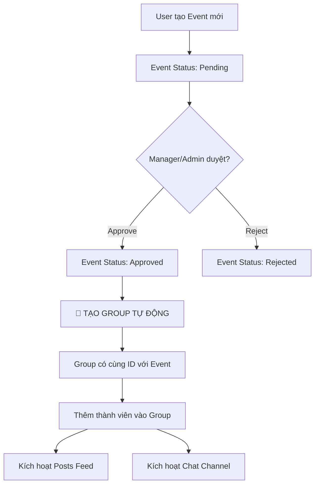

# 📋 Hệ thống Event Groups - Tự động tạo nhóm cho sự kiện

## 🎯 Mô tả chức năng

Sau khi một **sự kiện tình nguyện được duyệt** (approval status = "approved"), hệ thống sẽ **tự động tạo một Group** tương tự như Group trên Facebook với đầy đủ tính năng:

### ✨ Tính năng của Group:

1. **📰 Posts Feed (Tường)**:

   - Giống Facebook wall
   - Thành viên post bài viết, ảnh
   - Like, comment, share
   - Thảo luận về sự kiện

2. **💬 Chat Channel**:

   - Kênh chat riêng cho event
   - Real-time messaging
   - Trao đổi nhanh giữa các thành viên

3. **👥 Thành viên**:

   - Chỉ người tham gia event mới vào được
   - Hiển thị số lượng thành viên
   - Quản lý quyền truy cập

4. **ℹ️ Thông tin Event**:
   - Tên sự kiện
   - Ngày diễn ra
   - Trạng thái (Sắp diễn ra/Đang diễn ra/Đã hoàn thành)
   - Số lượng thành viên tham gia

## 🔄 Quy trình tự động tạo Group



## 📊 Cấu trúc dữ liệu

### Event (từ events.tsx)

```typescript
interface Event {
  id: number;
  title: string;
  description: string;
  date: string;
  location: string;
  maxParticipants: number;
  organizer: User;
  participants: User[];
  approvalStatus: "pending" | "approved" | "rejected";
  // ... other fields
}
```

### EventGroup (từ group.jsx)

```javascript
interface EventGroup {
  id: number;
  eventId: number; // Link to Event.id
  name: string; // Same as Event.title
  icon: string; // Auto emoji based on category
  color: string; // Auto color based on category
  memberCount: number; // = Event.currentParticipants
  eventDate: string; // = Event.date
  eventStatus: string; // upcoming/ongoing/completed
  unreadCount: number;
  lastMessage: string;
  isOnline: boolean;
  category: string; // = Event.category
}
```

## 🔧 Cách triển khai

### 1. Khi Event được approve:

```javascript
// Trong Events component - khi approve event
const handleApproveEvent = (eventId) => {
  // Update event status
  const event = events.find((e) => e.id === eventId);
  event.approvalStatus = "approved";

  // TỰ ĐỘNG TẠO GROUP
  const newGroup = {
    id: generateGroupId(),
    eventId: event.id,
    name: event.title,
    icon: getIconByCategory(event.category),
    color: getColorByCategory(event.category),
    memberCount: event.currentParticipants,
    eventDate: event.date,
    eventStatus: "upcoming",
    unreadCount: 0,
    lastMessage: "",
    isOnline: true,
    category: event.category,
  };

  // Lưu vào database
  createEventGroup(newGroup);

  // Thêm tất cả participants vào group
  addMembersToGroup(newGroup.id, event.participants);
};
```

### 2. Auto-assign Icon & Color theo Category:

```javascript
const categoryMapping = {
  "Môi trường": { icon: "🌳", color: "bg-green-500" },
  "Giáo dục": { icon: "📚", color: "bg-purple-500" },
  "Y tế": { icon: "💉", color: "bg-red-500" },
  "Cộng đồng": { icon: "🤝", color: "bg-blue-500" },
  "Trẻ em": { icon: "👶", color: "bg-pink-500" },
  "Người già": { icon: "👴", color: "bg-yellow-500" },
  // ... thêm categories
};
```

### 3. Phân quyền truy cập Group:

```javascript
const canAccessGroup = (userId, groupId) => {
  const group = groups.find((g) => g.id === groupId);
  const event = events.find((e) => e.id === group.eventId);

  // Chỉ cho phép:
  // 1. Người tham gia event
  // 2. Organizer
  // 3. Manager/Admin

  const isParticipant = event.participants.some((p) => p.id === userId);
  const isOrganizer = event.organizer.id === userId;
  const isManagerOrAdmin = ["manager", "admin"].includes(currentUser.role);

  return isParticipant || isOrganizer || isManagerOrAdmin;
};
```

## 📁 Files liên quan

1. **`/components/events.tsx`**: Quản lý events, approval process
2. **`/components/group.jsx`**: Group feed và chat
3. **`/api/events`**: API tạo/approve events
4. **`/api/groups`**: API tạo/quản lý groups

## 🔗 Integration Points

### Khi user vào Group:

```javascript
// Từ Events component, click vào event đã join
<button onClick={() => navigateToGroup(event.id)}>Vào nhóm</button>

// Redirect to: /group?eventId=123
// Group component sẽ load data based on eventId
```

### Sync data giữa Event và Group:

```javascript
// Khi có người mới join event
onNewParticipant(eventId, user) {
  // 1. Add to event.participants
  addParticipantToEvent(eventId, user);

  // 2. Add to group members
  addMemberToGroup(groupId, user);

  // 3. Update member count
  updateGroupMemberCount(groupId);

  // 4. Notify group về thành viên mới
  sendGroupNotification(groupId, `${user.name} đã tham gia nhóm!`);
}
```

## 🎨 UI/UX Flow

### 1. Sidebar Groups:

- Hiển thị tất cả groups của events user đã tham gia
- Badge màu đỏ cho tin nhắn chưa đọc
- Chấm xanh cho group đang active
- Tooltip hiện tên đầy đủ khi hover

### 2. Group Header:

- Icon + Tên event
- Số thành viên
- Ngày diễn ra
- Status badge (Sắp diễn ra/Đang diễn ra/Hoàn thành)

### 3. Posts Feed:

- Create post box
- List các bài post của thành viên
- Like, comment, share
- Upload ảnh

### 4. Chat Channel:

- Toggle show/hide
- Real-time messages
- Emoji, GIF support
- File sharing

## 🚀 Tương lai mở rộng

1. **Multiple Channels**: Mỗi group có thể có nhiều channel (general, announcements, photos...)
2. **Polls**: Tạo poll để vote trong group
3. **Events Timeline**: Timeline các hoạt động trong group
4. **File Library**: Kho lưu trữ files, photos của group
5. **Pinned Posts**: Ghim bài quan trọng lên đầu
6. **Notifications**: Push notification cho hoạt động trong group
7. **Search**: Tìm kiếm posts và messages trong group
8. **Analytics**: Thống kê hoạt động của group

## ⚠️ Lưu ý quan trọng

1. **Privacy**: Chỉ thành viên mới thấy content trong group
2. **Moderation**: Organizer/Manager có quyền xóa posts không phù hợp
3. **Archive**: Khi event completed, group chuyển sang read-only mode
4. **Cleanup**: Groups của events cũ (>6 tháng) có thể được archive
5. **Performance**: Lazy load posts và messages để tối ưu tốc độ

## 📝 Ví dụ thực tế

```
Event: "Trồng cây xanh - Công viên Tao Đàn"
├── Approval: Admin duyệt ngày 10/10/2025
├── Auto Create Group: "Trồng cây xanh - Công viên Tao Đàn"
│   ├── Icon: 🌳
│   ├── Color: Green
│   └── Members: 100 người (từ event participants)
│
├── Posts Feed:
│   ├── Organizer post: "Hướng dẫn chuẩn bị cho ngày trồng cây"
│   ├── Member post: "Mình đã mua găng tay rồi!"
│   └── Photos: 50 ảnh từ sự kiện
│
└── Chat:
    ├── "Gặp nhau lúc mấy giờ nhỉ?"
    ├── "7h sáng nha mọi người!"
    └── "Nhớ mang nước uống nhé!"
```

---

**Ghi chú**: System này tạo ra một community platform hoàn chỉnh cho mỗi sự kiện, giúp các thành viên kết nối, chia sẻ và tổ chức tốt hơn! 🎉
